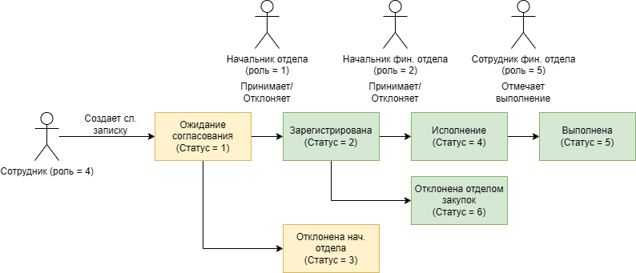

# Sever
Создано 03.02.2025
Последнее изменение 10.02.2025
## Навигация
- [Краткое описание](#краткое-описание)
- [Техническая реализация](#техническая-реализация)
- [Файлы конфигурации системы](#файлы-конфигурации-системы)
- [Структура базы данных](#структура-базы-данных)
- [Описание разработанных методов](#описание-разработанных-методов)

## Краткое описание
<p> Данное программное обеспечение представляет собой серверную часть веб-приложения по электронному документообороту для ПО "Север".</p>

## Техническая реализация
<ul>
    <li> <b>Язык программирования</b>: Python 3.8.10;
    <li> <b>Веб-фреймворк</b>: Flask 3.0.3;
    <li> <b>WSGI-сервер</b>: uWSGI 2.0.27;
    <li> <b>Веб-сервер: Nginx</b> 1.18.0;
    <li> <b>Операционная система</b>: Ubuntu-server 20.04;
    <li> <b>СУБД</b>: PostgreSQL 12.22;
    <li> <b>Файловый сервер</b>: MinIO v2024-12-18;
    <li> <b>Графический интерфейс БД</b>: PgAdmin4;
</ul>

## Файлы конфигурации системы

### Nginx
<p>
Настройка проксирования через веб-сервер Nginx осуществляется внесением изменения в файл конфигурации nginx.
</p>
<details>
<summary><b>uWSGI:</b></summary>

```nginx
# Конфигурационный файл: /etc/nginx/uwsgi_params
uwsgi_param  QUERY_STRING       $query_string;
uwsgi_param  REQUEST_METHOD     $request_method;
uwsgi_param  CONTENT_TYPE       $content_type;
uwsgi_param  CONTENT_LENGTH     $content_length;

uwsgi_param  REQUEST_URI        $request_uri;
uwsgi_param  PATH_INFO          $document_uri;
uwsgi_param  DOCUMENT_ROOT      $document_root;
uwsgi_param  SERVER_PROTOCOL    $server_protocol;
uwsgi_param  REQUEST_SCHEME     $scheme;
uwsgi_param  HTTPS              $https if_not_empty;

uwsgi_param  REMOTE_ADDR        $remote_addr;
uwsgi_param  REMOTE_PORT        $remote_port;
uwsgi_param  SERVER_PORT        $server_port;
uwsgi_param  SERVER_NAME        $server_name;
```
</details>

<details>
<summary><b>Sever:</b></summary>

```nginx
# Конфигурационный файл: /etc/nginx/sites-available/Sever
server {
    listen 8880;

    location / {
        include uwsgi_params;
        uwsgi_pass unix:/home/svyat/Sever/Sever.sock;
    }
}
```
</details>


### Сервисный файл
<p>
Юнит-файлы в systemd — это конфигурационные файлы, которые описывают, как запускать и управлять системными сервисами и процессами в Linux.
</p>
<details>
<summary><b>Unit-файл:</b></summary>

```ini
# Конфигурационный файл: /etc/systemd/system/Sever.service
[Unit]
Description=uWSGI instance to serve Sever app
After=network.target

[Service]
User=www-data
Group=www-data
WorkingDirectory=/home/svyat/Sever
ExecStart=/home/svyat/Sever/venv/bin/uwsgi --ini /home/svyat/Sever/Sever.ini

[Install]
WantedBy=multi-user.target
```
</details>

<details>
<summary><b>Команды для работы с сервисной службой:</b></summary>
<ul>
    <li> <b>Перезапуск системной службы:</b> <code class="language-bash">sudo systemctl daemon-reload</code>
    <li> <b>Установка автозапуска:</b> <code class="language-bash">sudo systemctl enable Sever</code>
    <li> <b>Статус:</b> <code class="language-bash">sudo systemctl status Sever</code>
    <li> <b>Запуск:</b> <code class="language-bash">sudo systemctl start Sever</code>
    <li> <b>Перезапуск:</b> <code class="language-bash">sudo systemctl restart Sever</code>
    <li> <b>Остановка:</b> <code class="language-bash">sudo systemctl stop Sever</code>
</ul>
</details>

## Структура базы данных
<p> База данных состоит из множества связанных друг с другом таблиц и приведена к третьей нормальной форме. 
</p>

### Константные данные
<p> К константным данным относятся данные, которые не подразумевают регулярных изменений в рамках работы приложения. Изменение константных данных разрешено только администратору приложения напрямую через базу данных, чтобы не нарушить работу приложения.
</p>

#### Статусы закупки
<p> Статус закупки - это обозначение этапа, который проходит определенная позиция из содержания служебной записки.
</p>
<p> Важно отметить, что имеется 2 вида договоров на опалату: обычный договор и счет-договор. И у каждого из них своя последовательность действий, поэтому имеется 2 коэффициента напротив статусов.
</p>

<details>
<summary><b>Существующие статусы закупки:</b></summary>
<table>
    <tr>
        <th>ID</th>
        <th>Название</th>
        <th>Коэффициент</th>
        <th>Коэффициент 2</th>
    </tr>
    <tr>
        <td>1</td>
        <td>Не установлено</td>
        <td>null</td>
        <td>null</td>
    </tr>
    <tr>
        <td>2</td>
        <td>Запрос ТКП </td>
        <td>0.1</td>
        <td>0.25</td>
    </tr>
    <tr>
        <td>3</td>
        <td>Заявка на проведения закупки</td>
        <td>0.15</td>
        <td>0.5</td>
    </tr>
    <tr>
        <td>4</td>
        <td>Согласование</td>
        <td>0.2</td>
        <td>null</td>
    </tr>
    <tr>
        <td>5</td>
        <td>Размещение закупки </td>
        <td>0.4</td>
        <td>null</td>
    </tr>
    <tr>
        <td>6</td>
        <td>Подведение итогов</td>
        <td>0.7</td>
        <td>null</td>
    </tr>
    <tr>
        <td>7</td>
        <td>Договор заключен</td>
        <td>0.9</td>
        <td>null</td>
    </tr>
    <tr>
        <td>8</td>
        <td>На складе</td>
        <td>1</td>
        <td>1</td>
    </tr>
    <tr>
        <td>9</td>
        <td>Оплата</td>
        <td>null</td>
        <td>0.75</td>
    </tr>
</table>
</details>

#### Статусы выполнения служебной записки
<p> Статусы выполнения служебной показывают прогресс реализации поданной служебной записки.
</p>

<details>
<summary><b>Существующие статусы исполнения:</b></summary>
<table>
    <tr>
        <th>ID</th>
        <th>Название</th>
    </tr>
    <tr>
        <td>1</td>
        <td>Ожидания согласования</td>
    </tr>
    <tr>
        <td>2</td>
        <td>Зарегистрирована</td>
    </tr>
    <tr>
        <td>3</td>
        <td>Отклонена руководителем отдела</td>
    </tr>
    <tr>
        <td>4</td>
        <td>Исполнение</td>
    </tr>
    <tr>
        <td>5</td>
        <td>Выполнена</td>
    </tr>
    <tr>
        <td>6</td>
        <td>Отклонена отделом МТО</td>
    </tr>
</table>
</details>

#### Роли пользователей
<p> Роли пользователей необходимы для разделения функциональности приложения.
</p>

<details>
<summary><b>Существующие роли:</b></summary>
<table>
    <tr>
        <th>ID</th>
        <th>Название</th>
        <th>Комментарий</th>
    </tr>
    <tr>
        <td>1</td>
        <td>Руководитель отдела</td>
        <td>Просмотр: реестр отдела (согласованные, отклоненные) Создание служебных записок. Одобрение служебных записок сотрудников.</td>
    </tr>
    <tr>
        <td>2</td>
        <td>Начальник отдела закупок</td>
        <td>Просмотр: полный реестр (согласованные, отклоненные). Назначение ответственных исполнителей.</td>
    </tr>
    <tr>
        <td>3</td>
        <td>Руководство компании</td>
        <td>Просмотр: полный реестр (согласованные, отклоненные).</td>
    </tr>
    <tr>
        <td>4</td>
        <td>Сотрудник</td>
        <td>Просмотр: свой реестр (согласованные, отклоненные). Создание служебной записки</td>
    </tr>
    <tr>
        <td>5</td>
        <td>Сотрудник отдела закупок</td>
        <td>Просмотр: собственного реестра (где назначен). Внесение изменений в содержание служебной записки</td>
    </tr>
</table>
</details>

<p> Важно отметить иерархичную структуру ролей, которая не позволяет всем пользователям получить доступ ко всем служебным запискам.
</p>
<p> Схематично это разделение функциональности по отношению к служебным запискам будет выглядеть следующим образом:
</p>



<p> Как можно заметить на изобрежении желтым отмечены статусы у служебных записок, при которых они видны только сотруднику создавшему эту служебную записку и его руководителю. Зеленым отмечены статусы исполнения служебных записок, при которых они видны уже всем остальным ролям.
</p>


## Описание разработанных методов
<p> Разработанные методы можно разделить на несколько категорий:
</p>
<ul>
    <li> Методы обработки служебных записок;
    <li> Методы для работы с пользовательскими данными;
    <li> Методы для получения селекторов;
    <li> Методы для поиска по реестру;
</ul>